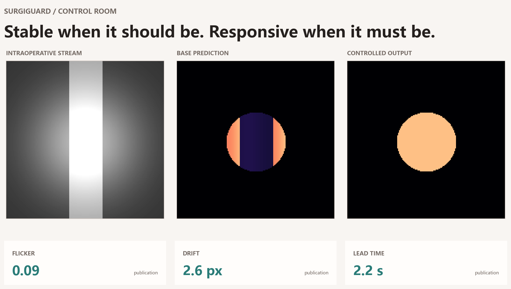
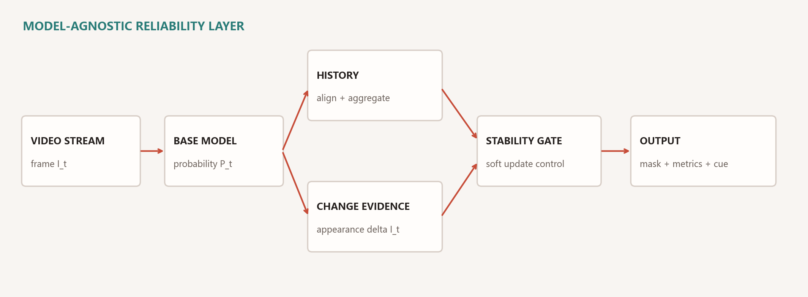
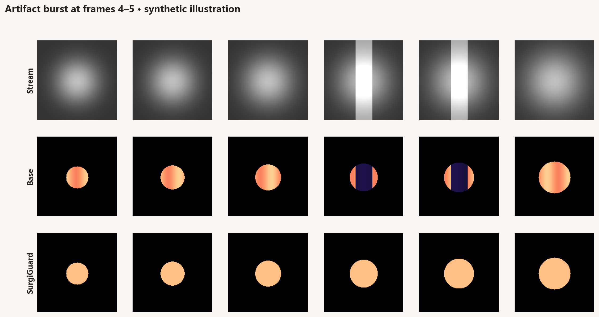

<div align="center">

# SurgiGuard

### Reliable intraoperative segmentation and risk-aware video intelligence

[](https://doi.org/10.1145/3770855.3818851)


**Project Lead & First Author — Jiutao Zhou**

</div>



SurgiGuard is a deployment-oriented reliability layer for intraoperative video segmentation. It
keeps an existing image segmenter fixed, controls how predictions evolve over time, and exposes
online stability metrics and short-horizon risk cues. The system has been deployed on a
collaborating hospital's server; this repository is the public, data-free project edition.

## Why this project exists

A model can score well frame by frame and still be difficult to trust as a stream. Instrument
motion, irrigation, material injection, occlusion, and acquisition changes can produce abrupt mask
flicker or spatial drift. Uniform smoothing removes some noise but can also hide a real procedural
change. SurgiGuard treats that stability–responsiveness tension as a control problem.

| Capability | What the system does |
|---|---|
| **Stable segmentation** | Aligns a short prediction history and rejects unreliable or extreme contributors. |
| **Change-aware updates** | Anchors stable regions while releasing the update where appearance and prediction evidence indicate change. |
| **Operational monitoring** | Tracks flicker, centroid drift, area trend, and persistent risk cues alongside the mask. |

## System view



The public implementation follows the same core separation as the deployed project: a model
adapter produces per-frame probabilities; the temporal controller estimates a reliability-filtered
history reference; a per-pixel gate mixes history and current evidence; monitoring modules observe
the resulting trajectory.



The image above is a synthetic illustration included to avoid distributing clinical data.

## Publication-reported results

The associated KDD 2026 paper evaluates 300 intraoperative sequences and three public surgical
benchmarks. The values below are **reported in the publication** and are not presented as a fresh
benchmark run from this public repository.

| Measure | Per-frame baseline | Stability-gated inference |
|---|---:|---:|
| Dice | 0.62 | **0.73** |
| Centroid drift | 5.8 px | **2.6 px** |
| Flicker rate | 0.21 | **0.09** |
| Trend-prompt lead time | 1.0 s | **2.2 s** |

## Repository layout

```text
src/surgiguard/
├── models/       # model-agnostic segmenter interface and MedSAM adapter boundary
├── temporal/     # alignment, robust reference, stability gate, controller
├── monitoring/   # flicker, drift, area trends, persistent alerts
├── service/      # FastAPI schemas and controller endpoint
└── pipeline.py   # end-to-end orchestration
app/              # Streamlit control-room demo on a synthetic sequence
scripts/          # video runner and sequence evaluator
configs/          # explicit operating points
tests/            # deterministic tests for the public core
```

## Quick start

```bash
python -m pip install -e ".[app,dev]"
python -m pytest -q
streamlit run app/streamlit_app.py
```

To connect an authorized segmentation model, expose a Python callable that accepts a BGR image and
returns a two-dimensional probability map in `[0, 1]`:

```bash
python scripts/run_video.py procedure.mp4 --predictor my_model:predict_probability
```

The controller API can also be launched independently:

```bash
uvicorn surgiguard.service.api:app --reload
```

## Public release boundary

- Hospital production source, clinical imagery, annotations, and model weights are not included.
- The public repository exposes the system architecture and representative implementation without
  copying the hospital environment.
- This software is a research and engineering artifact for clinical decision support; it is not an
  autonomous diagnostic or treatment system.

## Research output

**Jiutao Zhou**, Xiaoyang Li, Yuhao Zhang, Xiaoqian Peng, Weiguang Qu, Peirong Ma, and Yanhui Gu.
“Controlling Prediction Dynamics for Reliable Intraoperative Segmentation.” *KDD 2026*.
[Paper and DOI](https://doi.org/10.1145/3770855.3818851)

Please use [`CITATION.cff`](CITATION.cff) when citing this project.

## License

The public software is released under the [Apache License 2.0](LICENSE). Publication figures retain
their stated paper license and attribution.

